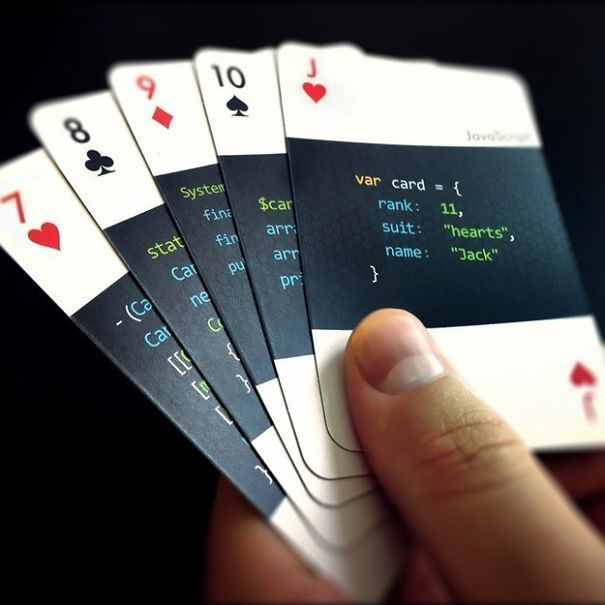

<h1 align="center">Ahmadullah Faizan</h1>
<h3 align="center">A passionate frontend developer from Afghanistan<h3>
<h1 align="left">My Experience</h1>

- 🔭 I’m currently staying on [Rana University](خانه - پوهنتون رنا https://share.google/456dqQhsk9YFrMj5u)

- 🌱 I’m currently learning **Advanced C++**

- 👨‍💻 All of my projects are available at [https://github.com/account](https://github.com/account)

- 💬 Ask me about **C++ & Python**

- 📫 How to reach me **akkhwaj@gmail.com**

<h3 align="left">Connect with me:</h3>

&nbsp;

